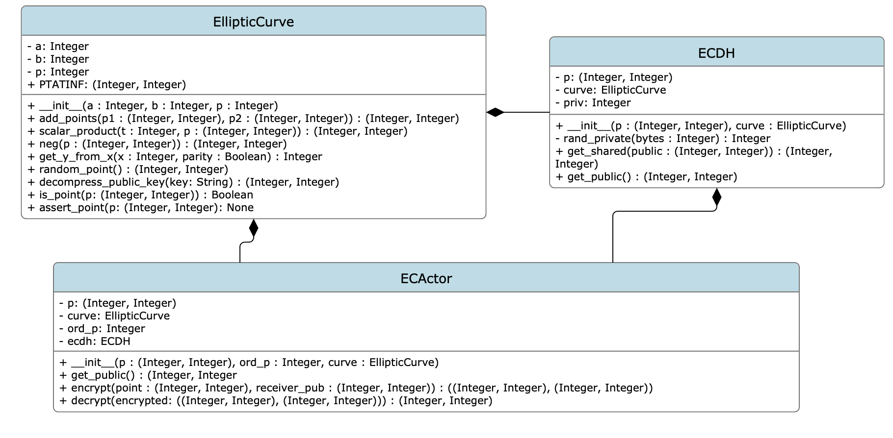

# ECCImplementation
This is a Python Implementation of Elliptical Curve Cryptography created as my Final Project for CSC471: Cryptography.
---
## UML Diagram

## Elliptic Curve Implementation (`ec.elliptic_curve.py`)
Defines an EllipticCurve object with the following properties and functions:

`self.PTATINF`: Point at Infinity

`__init__(self, a, b, p)`: Initialize an Elliptic Curve of the form $y^2 = x^3 + ax + b\mod{p}$

`add_points(self, p1, p2)`: Returns $P_1+P_1$ where $P_1,P_2\in E$

`scalar_product(self, t, p)`: Returns $t\cdot P$ using the Double-and-Add algorithm seen here [Elliptic Curve Paper (UChicago)](https://math.uchicago.edu/~may/REU2020/REUPapers/Shevchuk.pdf)

`neg(self, point)`: Returns $-P$

`get_y_from_x(self, x, pos=False)`: Returns $y$ coordinate corresponding to the $x$ coordinate given. If `pos` is `True`, it returns the negative value of $y\mod{p}$

`random_point(self)`: Returns a securely random point along the Elliptic Curve

`decompress_public_key(self, pk)`: "Decompresses" a point using the algorithm found here [BitCoin Stack Exchange](https://bitcoin.stackexchange.com/questions/86234/how-to-uncompress-a-public-key)

`is_point(self, p)`: Returns `True` if the point is on the curve, `False` otherwise

`assert_point(self, p)`: `assert self.ispoint(p)`

---
## Elliptic Curve Diffie Helmann Implementation (`ecdh/ecdh.py`)
Defines an `ECDH` object that has the following functions:

`__init__(self, p, curve)`: Defines an object capable of participating in Diffie-Helmann key exchanges based on Elliptic Curves.

`rand_private(self, bytes=124)`: Produces a random private key of length `bytes`

`get_shared(self, public)`: Returns shared key from others public key. Performs scalar multiplication $a\cdot B$ where $a$ is alice's private key and $B$ is Bob's public key.

`get_public(self)`: Returns $a\cdot P$

---
## Elliptic Curve ElGamal Cryptosystem Implementation (`ec_elgamal/ec_actor.py`)
Defines a class `ECActor` to encrypt and decrypt points along an Elliptic Curve

`__init__(self, p, ord_p, curve)`: Creates an actor that uses point $P$ with order $ord_P$ to move along the curve given by `curve`. Also defines an object `self.ecdh=ECDH(p, curve)`

`get_public(self)`: Gets the public key of the embedded Elliptic Curve Diffie Helman object

`encrypt(self, point, receiver_pub)`: Encrypts a point using the other actor's public key

`decrypt(self, encrypted_output)`: Decrypts a pair of points containing other actor's public key and their encrypted result
